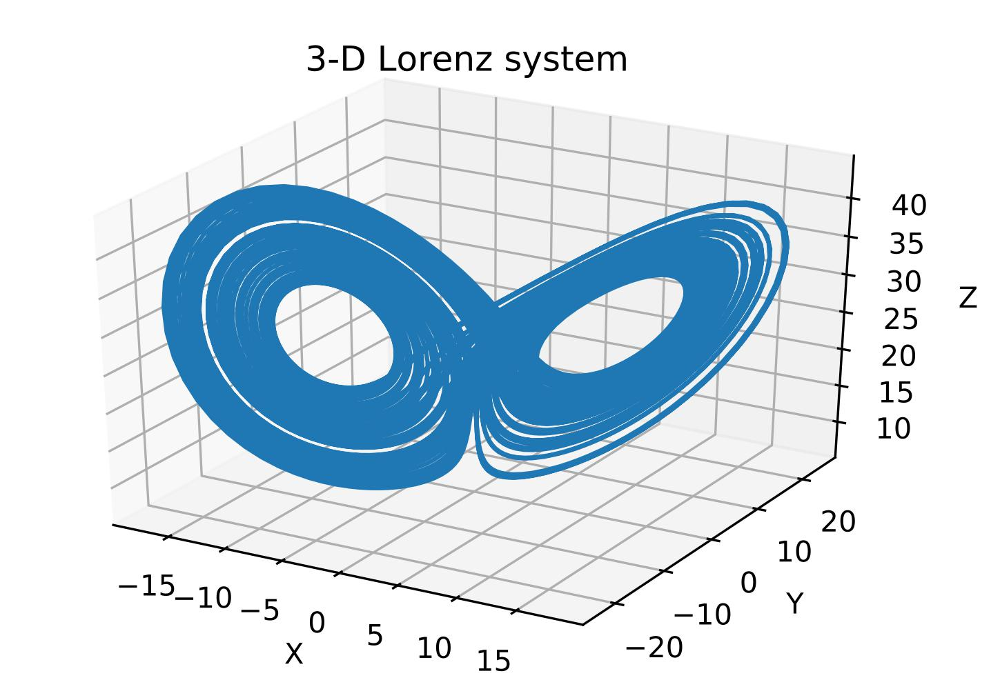

# 01.02-Propagating-Uncertainty-3D-Lorenz-Attractor

This experiment evaluates GP-LSTM's (Gaussian Process regression in combination with LSTM's) on their ability to forecast the predictive distribution of dynamical systems.
The GP-LSTM models are built using the keras-gp library (https://github.com/alshedivat/keras-gp).

Please check the [README_Lorenz_attractor File](README_Lorenz_attractor.docx) for detailed instructions on how to run the experiment.

*01.02 Three-Dimensional Lorenz Attractor*

The predictive distributions of the GP-LSTM model are evaluated on the 3-Dimensional Lorenz Attractor.

This attractor system was initially developed by Edward N. Lorenz as a simple
model for atmospheric convection and dissipative hydrodynamic flows. The
system exhibits chaotic behavior for certain parameter values.
An attractor describes a collection of numerical values to which a dynamical
system tends to evolve. The set of values can be a single point, a curve or a
highly complex shape known as a strange attractor. For points near or within
the attractor space, the values stay close even if disturbed. The points follow the
trajectories of the attractor.

The Lorenz attractor consists of a system of three differential equations describing
the temperature and convection dynamics of a two dimensional fluid layer.

$\frac{\partial x}{\partial t} \ = \sigma(y-x)$

$\frac{\partial y}{\partial t} \ = x(\rho-z)-y$

$\frac{\partial z}{\partial t} \ = xy-\beta z$

Where:

• x proportional to the rate of convection

• y proportional to the horizontal temperature variation

• z proportional to the vertical temperature variation

• σ, ρ, β: System parameter proportional to the Prandtl number, Rayleigh
number and to physical dimensions of the fluid layer itself

Applying the above described system of differential equations results in the plot below:

The system of differential equations is deterministic with no stochastic behaviour given that all three dimensions are provided.
This means we would expect very low predictive uncertainties from the GP-LSTM model and accurate mean predictions if the full input space is used by the model.

The influence of a reduced input space on the GP-LSTM predictive distribution is investigated by using a 1- and 3- dimensional input.
The convection rate x is forecasted using only the information of the x-dimensionand the full available space of all three dimensions x-y-z.

The propagation algorithm is utilized to propagated the GP-LSTM predictive
distribution for the convection rate x over 10 time steps.
The predicted dynamics for both input spaces are shown below including the predicted confidence bound:

The figure below compares the two variance evolutions using a one and three dimensional input space. 

Propagating the one-dimensional input space predictions results in less confident distributions compared to the model that uses the full input space.
Hence, the lack of information about the vertical and
horizontal temperature variation represent an additional source of uncertainty
that is taken into account by the GP-LSTM.
